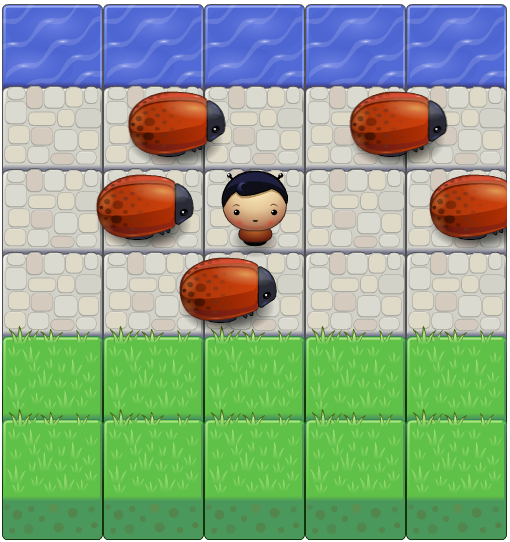

# Arcade Game Project

HOW FAST ARE YOU?

## about game

Hi there! this is a small project programmed using java script.  
We use The HTML `<canvas>` element.  
It is used to draw graphics on a web page.  
The code is implemented using JavaScript OOP features.  

## How you can play Arcade Game :
You just need to download it from github by normal downloading or cloning  
and click on index.html file and it will run on your default browser.  

## Contributing
This repository is the starter code for _all_ Udacity students. > 

## For More 
See this videos 
<a href="https://www.youtube.com/user/Udacity">Youtube</a>

